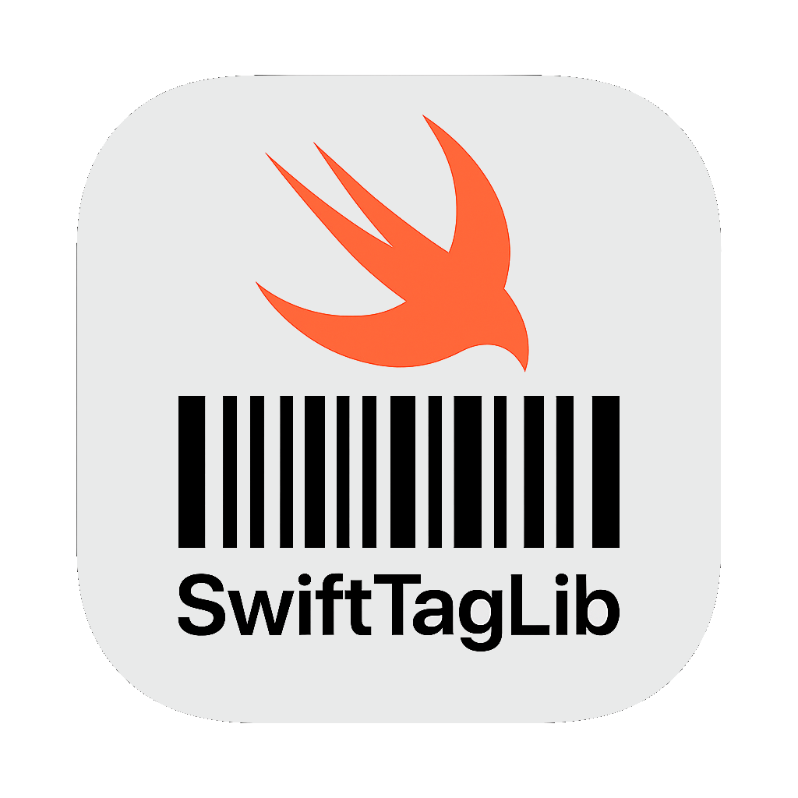

<div align=center>


# SwiftTagLib
 

</div>

A library to read and write **Metadata** in audio files.
Built on top of [`taglib`](https://github.com/taglib/taglib) [`v2.1`](https://github.com/taglib/taglib/tree/v2.1).

Heavily inspired by [`SFBAudioEngine`](https://github.com/sbooth/SFBAudioEngine/) and made as an adaptation of it with focus on **metadata**. 
You can review differences from [`SFBAudioEngine`](https://github.com/sbooth/SFBAudioEngine/) [here](./Differences-from-SFBAudioEngine-and-how-it-works.md).

## Usage

```swift
import SwiftTagLib

// create audio file from url: reads it's metadata & properties
let url = URL(fileURLWithPath: "./path/to/audiofile.mp3")
var audioFile = try AudioFile(url: url)

// by default images are read from metadata during initialization
// skipping them will reduce time spent reading metadata
audioFile = try AudioFile(url: url, options: [.skipImages])
// if you need to know if file metadata has attached pictures
print("has attached pictures:", audioFile.metadata.hasAttachedPictures)

// get metadata values
print("song:", audioFile.metadata.artist ?? "_", "-", audioFile.metadata.title ?? "_")
print("bitrate:", audioFile.properties.bitrate, "duration:", aduioFile.properties.duration)
let picture = audioFile.metadata.attachedPictures.first

// set metadata values
audioFile.metadata.title = "Song name"
audioFile.metadata.lyrics = .none
audioFile.metadata.attachedPictures = [
    .init(data: Data(), kind: .frontCover, description: "album cover")
]

// write metadata changes
try audioFile.write()
```

> [!WARNING] 
> This library does not state or guarantee ABI stability despite packaging `XCFramework`'s.
> Whenever the version changes you should recompile.

## Note on C++ Interoprability

This library is done using [Swift C++ Interop](https://www.swift.org/documentation/cxx-interop/) (there are some [limitations](https://www.swift.org/documentation/cxx-interop/status/) to consider).
[Understanding Objective-C and Swift interoperability](https://rderik.com/blog/understanding-objective-c-and-swift-interoperability/).
Currently supporting reading from most of the same types as [`SFBAudioEngine`](https://github.com/sbooth/SFBAudioEngine/) in C++ Bridge.

## Development

After cloning this repository you should call the following(in it's root directory), to fetch the git submodules:
```sh
git submodule update --init
```

The `Package.swift` in the root directory is a wrapper for underlying `Package.swift` in `XCFrameworkPackage` directory, you should work with/edit the latter.

To compile `Package.swift` in `XCFrameworkPackage` as bunch of `.xcframework`'s, go into `XCFrameworkPackage` directory and call:
```sh
make
```

## Acknowledgments

This library would not be possible without any of this libraries:
- [SFBAudioEngine](https://github.com/sbooth/SFBAudioEngine/)
- [taglib](https://github.com/taglib/taglib)
- [utfcpp](https://github.com/nemtrif/utfcpp)

## Notes

- [WMA](https://en.wikipedia.org/wiki/Advanced_Systems_Format) file format is supported by taglib [here](https://taglib.org/api/namespaceTagLib_1_1ASF.html#details), but not `SFBAudioEngine`, can probably try to support it even though it's outdated.
- taglib v2.1 introduced **shorten** file support, but no changes were made to accomodate that yet.
